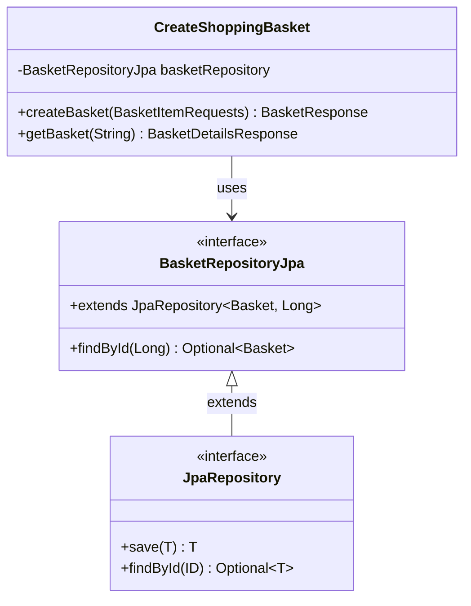

# 쇼핑 바스켓 TDD 구현

## 1. **SRS(소프트웨어 요구사항 명세서) 작성**

### 쇼핑 바스켓 SRS(소프트웨어 요구사항 명세서)

#### 기본 기능 요구사항
- 사용자는 장바구니에 상품을 추가할 수 있어야 한다
- 각 상품은 상품명, 단가, 수량 정보를 포함해야 한다
- 동일한 상품을 여러 번 추가하면 수량으로 합산 처리해야 한다
- 시스템은 장바구니 내 모든 상품의 총 금액을 계산해야 한다 (단가 × 수량의 합계)
- 시스템은 할인 규칙에 따라 할인 금액을 계산해야 한다
- 시스템은 최종 결제 금액이 포함된 영수증을 생성해야 한다

#### 할인 규칙 요구사항
- 총 금액이 10,000원 이하인 경우: 할인을 적용하지 않는다
- 총 금액이 10,000원 초과 20,000원 미만인 경우: 5% 할인을 적용한다
- 총 금액이 20,000원 이상인 경우: 10% 할인을 적용한다
- 할인 금액 계산 시 소수점이 발생하면 반올림 처리한다
- 최종 결제 금액 = 소계 - 할인 금액

#### 데이터 제약 조건
- 상품의 단가와 수량에는 특별한 제한이 없다
- 상품명은 필수 입력 항목이다

#### 예외 처리 요구사항
- 장바구니가 비어있는 상태에서 영수증 생성을 요청하면 예외를 발생시켜야 한다

#### 영수증 출력 요구사항
- 각 상품별로 상품명, 수량, 단가, 소계를 표시해야 한다
- 전체 소계를 표시해야 한다
- 할인 금액을 표시해야 한다
- 최종 결제 금액을 표시해야 한다
- 영수증 형태로 읽기 쉽게 포맷팅되어야 한다

## 2. **SRS를 잘 설명할 수 있는 예제 목록 작성**

### 쇼핑 바스켓 예제 시나리오

#### 예제 1: 10,000원 이하 - 할인 없음
- 상품: 보호필름 2개 (단가: 5,000원, 총액: 10,000원)
- 소계: 10,000원
- 할인: 0원 (할인 없음)
- 최종 결제 금액: 10,000원

#### 예제 2: 10,000원 초과 20,000원 미만 - 5% 할인
- 상품: 
  - 스마트폰 케이스 1개 (단가: 12,000원, 총액: 12,000원)
  - 보호필름 1개 (단가: 3,000원, 총액: 3,000원)
- 소계: 15,000원
- 할인: 750원 (5% 할인)
- 최종 결제 금액: 14,250원

#### 예제 3: 정확히 20,000원 - 10% 할인 적용
- 상품:
  - 스마트폰 케이스 1개 (단가: 15,000원, 총액: 15,000원)
  - 보호필름 1개 (단가: 5,000원, 총액: 5,000원)
- 소계: 20,000원
- 할인: 2,000원 (10% 할인)
- 최종 결제 금액: 18,000원

#### 예제 4: 빈 장바구니 - 예외 발생
- 장바구니에 상품이 없는 상태에서 영수증 생성 요청
- 시스템은 적절한 오류 메시지와 함께 예외를 발생시켜야 함

## 3. **High Level Test 작성**

### High Level Test 구현 완료
- 대표 예제: 정확히 20,000원 - 10% 할인 적용 케이스
- POST /api/baskets로 장바구니 생성 후 GET /api/baskets/{id}로 결과 확인
- Approvals Test를 통한 영수증 형태 검증

### 도메인 클래스 다이어그램

```mermaid
classDiagram
    class Basket {
        +Long id
        +List~BasketItem~ items
    }
    
    class BasketItem {
        +String name
        +BigDecimal price
        +int quantity
        +BigDecimal total
    }
    
    class BasketItemRequests {
        +List~BasketItemRequest~ items
    }
    
    class BasketItemRequest {
        +String name
        +BigDecimal price
        +int quantity
    }
    
    class BasketResponse {
        +String basketId
    }
    
    class BasketDetailsResponse {
        +String basketId
        +List~BasketItemDto~ items
        +BigDecimal subtotal
        +BigDecimal discount
        +BigDecimal finalAmount
    }
    
    class BasketItemDto {
        +String name
        +int quantity
        +BigDecimal price
        +BigDecimal total
    }
    
    Basket ||--o{ BasketItem : contains
    BasketItemRequests ||--o{ BasketItemRequest : contains
    BasketDetailsResponse ||--o{ BasketItemDto : contains
```

## 4. **테스트 케이스 목록 작성**

### 쇼핑 바스켓 테스트 케이스 목록

가장 단순한 특수 케이스(degenerate)에서 일반적인 케이스(general)로 진행하는 테스트 리스트:

- [X] 빈 장바구니에서 청구서 요청 시 예외 발생
- [X] 단일 상품을 1개만 장바구니에 추가 (할인 없음, 10,000원 이하)
- [X] 10,000원 초과 20,000원 미만 구매 시 5% 할인 적용
- [X] 20,000원 이상 구매 시 10% 할인 적용

## 5. **Walking Skeleton 구현**

### Walking Skeleton 구현 완료
- end-to-end 테스트 추가: 충전 케이블 1개 (8,000원) 케이스
- Controller, Repository, Domain Model 구조 완성
- FakeRepository를 통한 in-memory 저장소 구현
- 최소한의 하드코딩으로 테스트 성공

## 6. **테스트 리스트에서 테스트 선택해서 테스트 추가하기(더 이상 추가할 테스트가 없을때까지)**

### 6.1 빈 장바구니에서 청구서 요청 시 예외 발생 테스트 추가

빈 장바구니 예외 처리 테스트 구현
- 빈 BasketItemRequests 전송 시 400 Bad Request 응답 검증하는 테스트 추가
- CreateShoppingBasket에 request.items().isEmpty() 체크 로직 추가
- IllegalArgumentException 발생 시 BadRequest로 변환하는 GlobalExceptionHandler 구현

### 6.2 단일 상품을 1개만 장바구니에 추가 (할인 없음, 10,000원 이하) 테스트 추가

단일 상품 장바구니 기본 기능 구현
- 보호필름 5,000원 1개 추가하여 할인 없는 경우 테스트 추가
- 하드코딩된 충전 케이블에서 실제 요청 데이터 사용하도록 변경
- BasketItem 생성 시 단가 × 수량 계산 로직 추가
- getBasket에서 실제 저장된 데이터 기반으로 응답 생성하도록 변경

### 6.3 10,000원 초과 20,000원 미만 구매 시 5% 할인 적용 테스트 추가

5% 할인 로직 구현
- 스마트폰 케이스 12,000원 + 보호필름 3,000원 = 15,000원 케이스 테스트 추가
- getBasket 메서드에 할인 계산 로직 추가
- 10,000원 초과 20,000원 미만일 때 5% 할인 적용하는 조건문 구현
- subtotal에서 discount를 차감한 finalAmount 계산 로직 추가

### 6.4 20,000원 이상 구매 시 10% 할인 적용 테스트 추가

10% 할인 로직 구현 및 할인 체계 완성
- 스마트폰 케이스 15,000원 + 보호필름 5,000원 = 20,000원 케이스 테스트 추가
- 할인 로직을 if-else if 구조로 리팩터링하여 우선순위 명확화
- 20,000원 이상일 때 10% 할인이 먼저 적용되도록 조건 순서 변경
- 모든 할인 규칙 (할인 없음, 5% 할인, 10% 할인) 구현 완료

## 7. **High Level Test 활성화**

## 8. **Jpa Repository 구현**

### Jpa Repository 구현 완료
- Entity와 Value Object에 대해서 JPA 매핑 작성 (누락된 어노테이션 추가)
- BasketRepositoryJpa 직접 사용하도록 구조 간소화
- 불필요한 BasketRepository 인터페이스와 BasketRepositoryImpl 제거
- Entity 간 연관관계 설정 (@OneToMany, @ManyToOne, setBasket 메서드) 추가

### JPA 테스트 실행을 위한 문제 해결
- FakeRepository 관련 코드 완전 제거 (주석 처리된 코드, basketRepository 필드 등)
- 테스트 클래스에 `@Transactional` 추가하여 Lazy Loading 문제 해결
- `@ActiveProfiles("test")` 추가하여 테스트용 설정 분리
- H2 테스트 데이터베이스 설정 추가 (application-test.yml)
- BasketRepositoryJpa에 `@EntityGraph(attributePaths = {"items"})` 추가하여 N+1 문제 방지
- application.properties를 application.yml로 변경

### Repository 클래스 다이어그램



## 9. **테스트 코드 리팩토링 (DSL 및 중복 제거)**

### 테스트 코드 개선 작업 완료
- 기존 테스트 코드의 중복과 가독성 문제 해결을 위해 DSL 패턴 적용
- Test Data Builder와 Protocol Driver 패턴 도입으로 테스트 인프라 개선

### Protocol Driver 패턴 적용
- `BasketApi` 클래스로 MockMvc 호출을 캡슐화
- 테스트 인프라 지식을 Protocol Driver에 격리
- API 레벨에서 일관된 테스트 인터페이스 제공
- 에러 케이스와 성공 케이스를 명확하게 분리한 메서드 제공

### Test Data Builder 패턴 적용  
- `BasketBuilder`와 `BasketItemBuilder` 클래스로 테스트 데이터 생성 추상화
- `aBasket()`, `anItem()` 등의 DSL 스타일 팩토리 메서드 제공
- Fluent Interface를 통한 직관적인 테스트 데이터 구성
- 테스트 데이터 생성의 복잡성을 Builder 내부로 캡슐화

### 중복 제거 및 가독성 향상
- 반복되는 MockMvc 호출 패턴 완전 제거
- 테스트의 given-when-then 구조가 더 명확하게 표현됨
- 비즈니스 의도가 테스트 코드에서 직관적으로 드러남
- 중복 테스트 케이스 식별 및 제거 (`create_and_verify_basket_with_discount` 삭제)

### printBasketDetails 메서드 개선
- 하드코딩된 String 반환에서 실제 BasketDetailsResponse 데이터 활용으로 변경
- 동적 영수증 생성으로 각 테스트의 실제 데이터 검증
- 천 단위 구분자와 할인율 계산 추가로 가독성 향상
- 메서드가 전달받은 인자를 실제로 검증하고 활용하는 의미있는 구현
